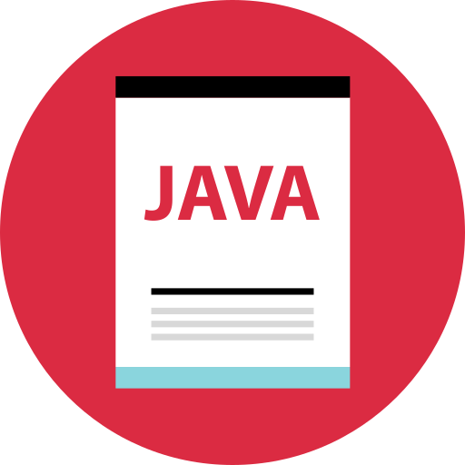

<h1 align="center">Hi 👋, I'm Ch1ky</h1>

<h2> 🧑‍💻 Who I am? </h2>
My name is Sebastián but all call me Ch1ky, and I am currently studying cybersecurity. I am passionate about pentesting and expanding my knowledge in Python and LaTeX. I am also learning C++, Bash, and Java to strengthen my skills. I have experience with both Linux and Windows operating systems in user and server environments.

<h3 align="left">📨 Connect with me</h3>
Feel free to reach out for discussions, collaborations, or opportunities related to cybersecurity and software development. You can contact me here on GitHub or send me a DM in Discord.

 
 

<!-- Aquí puedes añadir tus enlaces de redes sociales -->

<h2>🌱 Goals</h2>
I am committed to expanding my skills in cybersecurity and networks, applying my knowledge to practical projects and contributing to the community. I am eager to learn and collaborate with professionals in the field to develop effective solutions for security challenges.

<h2>💡 Skills!</h2>

<h3>Languages Learned</h3>

  

     Python
  

  

     LaTeX
  

<h3>Languages in Learning</h3>

  

     Bash
  

  

     Java
  

  

     C++
  

<h3>Database</h3>

  

     MySQL
  

<h3>Tools</h3>

  

     GitHub Desktop
  

<h3>IDEs</h3>

  

     Visual Studio Code
  

<h3>Operative Systems</h3>

  

     Linux
  

  

     Windows
  

### 💼 Interests:
- 🌐 **Pentesting and Security:** Focused on evaluating system and network security.
- 🐍 **Python:** Scripting for automation and data analysis.
- 📄 **LaTeX:** Creating technical and academic documents with high typographical quality.
- 💻 **Operating Systems:** Experience in Linux and Windows environments.

